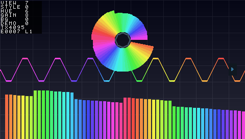

# 12 显示链设计（频谱可视化）

> 上游依赖：[11-fft-design.md](11-fft-design.md) 的 `fft_core`
> 下游依赖：[06-board-resources.md](06-board-resources.md) §9 的 480×272 液晶屏

---

## 1. 总体架构与三个扩展口

```
clk_sys 域（48 MHz，音频 + 控制）              clk_pix 域（12.5 MHz，显示）
┌────────────────────────┐                  ┌────────────────────────────────────┐
│ audio_rcv / i2s        │                  │  lcd_timing ──(x,y)──┐             │
│      ↓                 │                  │                      ▼             │
│ eq_cascade ──▶ i2s_tx  │                  │              ┌──────────────┐      │
│                        │                  │              │  disp_mix    │────▶ │
│ fft_core               │                  │              └──────────────┘      │
│      ↓                 │  32×9 bit        │                 ▲        ▲         │
│ spectrum               │ ─[快照]─▶ 跨域 ─▶│                 │        │         │
│  (柱高+峰值衰减)       │                  │        bg_src ──┘        └─ ui_ctrl│
└────────────────────────┘                  └────────────────────────────────────┘
  ▲          ▲          ▲
  │          │          │
UART       KEY1/2     触摸(XPT2046)
```

### 1.1 为什么不做「整屏重绘 + 像素流」

参考工程 Music-Spectrum 用了一个 400 行的渲染状态机（嵌套计数器扫过全屏，
生成像素流再经 FIFO 送给显示驱动）。**它这么做的唯一理由是：背景图存在 SD 卡里，
必须流式取回来才能混合。**

我们的背景先用组合逻辑算（网格/渐变），于是可以**扫描到哪算到哪**：

```verilog
bar = (H_Addr / BAR_W);                      // 这一列属于第几根柱
lit = (V_Addr >= V_DISP - bar_height[bar]);  // 从底部往上点亮
```

没有渲染状态机、没有 FIFO、没有 BRAM 仲裁。将来换成流式背景图时，
**只需要替换 `bg_src` 这一个模块**，其余全部不动。

### 1.2 三个必须现在就留的口子

| 口子 | 现在 | 将来 | 为什么现在留 |
| --- | --- | --- | --- |
| **① `bg_src` 抽象** | 组合逻辑生成网格/渐变 | SD 卡 / QSPI Flash 流式取像素 | 流式源需要**预取**（见 §5），接口不一样。统一成 `(x,y) → bg_rgb` + 可选的 `bg_valid` 握手 |
| **② `ui_ctrl` 统一配置** | 硬编码 | 按键 / 触摸 / UART **都写同一组寄存器** | 三个输入源汇到一处，显示链只读它。否则会变成三套并行逻辑 |
| **③ 跨域传「整帧快照」** | 32×9 bit | 柱高 + 峰值 + 模式 + 配色索引 | 用**乒乓双缓冲 + 同步 toggle**，不是每条数据一个 FIFO |

---

## 2. `lcd_timing` —— 时序发生器（已完成 ✅）

`rtl/video/lcd_timing.v`，实测 **56 LUT / 47 FF**。

### 2.1 为什么自己写而不用参考工程的 `disp_driver`

时序参数**可以直接抄**（已与璞致官方例程逐字核对），但那个模块用
`` `include `` 头文件 + 宏开关的写法，与本工程「参数化 Verilog-2001 模块」风格不统一。

### 2.2 屏幕的四个"非标准"之处

```
① 没有 DE 脚      —— 子卡用 0Ω 把 LCD_DE 拉高了，面板靠 HS/VS + 固定时序自己推算有效区
② RGB888 不是 RGB565 —— 24 位，璞致官方例程确认
③ HSYNC / VSYNC 都是低有效
④ 像素时钟 12.5 MHz -> 帧率 83.25 Hz（不是标准的 60 Hz）
```

### 2.3 ⚠️ 时序契约（写上层逻辑必须记住）

```
周期 T   : x / y = 当前扫描位置（组合输出），调用方据此算 rgb_in
周期 T+1 : de / hsync / vsync / rgb_out 一起寄存输出
           rgb_out = rgb_in(T)，即【上一拍 x/y 对应的颜色】
```

**`de` 与 `x` 天然差一拍** —— 这是刻意的：调用方需要当拍的 x/y 才来得及算颜色，
而送到屏幕的一组信号必须互相严格对齐。对应关系是

```
de(T+1)  ↔  x(T)  ↔  rgb_out(T+1)          不是  de ↔ x
```

> 写 TB 时如果拿当拍的 `x` 去对 `de`，会得到"全部错"的假结果
> （本项目第一版 TB 就报了 261120 处假错误）。

### 2.4 验证：七项守恒

不靠看波形，用**一帧总量守恒** + **逐像素遍历**：

| 检查 | 期望 | 实测 |
| --- | --- | --- |
| 帧周期 | 525 × 286 = 150150 拍 | ✅ 12.012 ms (83.25 Hz) |
| DE 像素数 | 480 × 272 = 130560 | ✅ |
| HSYNC 低电平 | 41 × 286 = 11726 | ✅ |
| VSYNC 低电平 | 10 × 525 = 5250 | ✅ |
| DE 每行连续 | 480 拍无断点 | ✅ |
| x 遍历 | 每行 0→479 连续 | ✅ |
| y 遍历 | 每行 +1 到 271 | ✅ |
| rgb 对齐 | 与 `de` 同拍，DE 外恒 0 | ✅ |

> **统计方法有个讲究**：不能从复位开始累加（复位释放点随机落在帧中间）。
> 改成取**相邻两次 `sof` 之间的差值**，正好覆盖完整一帧。

---

## 3. `spectrum` —— 柱高生成（已完成 ✅）

`rtl/audio/spectrum.v`，实测 **473 LUT / 303 FF**。

### 3.1 处理链

```
bin 流 ─▶ ①对数频率分组 ─▶ ②组内取最大 ─▶ ③幅度→高度 ─▶ ④峰值保持+衰减
          spectrum_map       逐柱累积          dB 压缩        每帧一次
```

### 3.2 ① 频率分组：低频线性 + 高频对数

**为什么不能纯对数**：512 个 bin 分 60 根柱，平均每根只有 8.5 个 bin。
低频段 bin 很密（bin 1 = 47 Hz），纯对数时前几根柱只覆盖 1 个甚至 0 个 bin ——
会看到一根根空柱子。

**本工程分组**（表由 `scripts/golden/gen_spectrum_map.py` 生成）：

```
柱 0..15    : bin 0..15          （线性，每柱 1 个 bin，覆盖到约 703 Hz）
柱 16..59   : bin 16 -> 511      （对数均分，5 个八度 / 44 根柱 ≈ 8.8 根柱一个八度）
```

> **柱数为什么是 60 而不是 32 或随便一个数**：
> 屏幕宽 480，柱数要能让 `480/N` 落成 **2 的幂**，这样算柱下标只要一次移位。
> 60 → 每根 8 px → `x[8:3]`；30 → 16 px → `x[8:4]`。
> 32 → 15 px，算下标要做除法，不值得。

| 柱 | bin 范围 | 频率范围 | 柱宽 |
| --- | --- | --- | --- |
| 0 | 0 | 0 – 47 Hz | 1 |
| 15 | 15 | 656 – 703 Hz | 1 |
| 16 | 16–17 | 750 – 844 Hz | 2 |
| 32 | 41–44 | 1.92 – 2.11 kHz | 4 |
| 44 | 106–114 | 4.97 – 5.34 kHz | 9 |
| 52 | 233–251 | 10.9 – 11.8 kHz | 19 |
| 59 | 473–511 | 22.2 – 24.0 kHz | 39 |

> 完整 60 行表见生成脚本的输出。每根柱约 8.8 根柱一个八度，
> 和音乐听感一致（30 根柱时是每 4 根一个八度）。

### 3.3 ③ 幅度 → 高度：dB 压缩

对比三种做法：

| 做法 | 效果 |
| --- | --- |
| 线性 | 只有最强的几根柱子看得见，音乐一停全塌 |
| 开方 | 压缩不足，动态范围还是太大 |
| **dB（log2 近似）** | 标准频谱分析仪做法，视觉上最接近"听觉响度" ✅ |

**实现**（不用任何乘法器）：

```
mp    = 最高位位置(mag)                     // 优先编码器
nrm   = mag << (24 - mp)                    // 把最高位对齐到 bit24
ilog2 = { mp[4:0], nrm[22:20] }             // Q5.3：5 位整数 + 3 位小数
高度   = clamp( (ilog2 - DB_OFFS) << SCALE_SH , 0, 511 )
```

- 每个 `ilog2` 单位 = 1/8 个八度 = **0.7525 dB**
- 默认 `DB_OFFS=64`（log2=8，即 mag < 256 显示为 0）、`SCALE_SH=2`
- 折算下来 **每像素约 0.188 dB，满量程约 96 dB 动态范围**

### 3.4 ④ 峰值保持：跟涨不跟跌

```verilog
upd = (raw >= old)                             ? raw          // 立即跟上
    : ((old >= DECAY) && ((old - raw) >= DECAY)) ? (old - DECAY) // 每帧线性衰减
    :                                               old;         // 保持在原处
```

> ⚠️ 第三行用的是 `>=` 而不是 `>`。用 `>` 的话，柱子在降到刚好等于 `DECAY`
> 时会永远停住，再也回不到 0（6/511 虽然看不见，但语义是错的）。

### 3.5 验证：穷举全部 512 个 bin

| 检查 | 方法 | 结果 |
| --- | --- | --- |
| ① 分组映射 | **逐个 bin 灌进去**，看哪根柱响应 | 512/512 各落唯一柱 ✅ |
| | 结构性质：映射单调不减、32 根柱全非空 | ✅ |
| | 八度点 bin 8/16/32/64/128/256 → 柱 8/12/16/20/24/28 | ✅ |
| ② 组内取最大 | 柱 31 里灌 2^16 与 2^18 | 取 2^18 ✅ |
| ③ dB 压缩 | 灌 2^n (n=0..24)，与公式逐点比对 | 25/25 ✅ |
| ④ 峰值保持 | 建立峰值后灌 80 帧全零 | 每帧精确降 6，到 0 停住 ✅ |
| ⑤ 饱和 | 灌满量程 | 钳位 511，无回绕 ✅ |

---

## 4. 三种视图合成（已完成 ✅）



### 4.1 屏幕分区（480 × 272）

```
    y 16  ┌────────────────────────────────────────┐
          │                ╭──────────╮            │
          │               (     ◉     )            │  极坐标：圆心 (240, 78)
          │                ╰──────────╯            │        内半径 16，外半径 62
  y 114   │  ~~~~~~~~~~~~~~~波形~~~~~~~~~~~~~~~~~~  │  波形：中线 y = 136（固定）
  y 136   │  ~~~~~~（屏幕垂直中心，左右展开）~~~~~~  │        振幅 ±22，线宽 ±1
  y 158   │                                        │  ← 极坐标画在波形之上
  y 176   ├────────────────────────────────────────┤
          │    ▁▃▅▇█▇▅▃▁   柱状频谱                  │  柱状：y 176~271（96 px 高）
  y 272   └────────────────────────────────────────┘        60 根 × 8 px（全宽）
```

> **布局常数全部集中在 `rtl/video/disp_cfg.vh`**，RTL 和 testbench 都 `include 同一份。
> 这是被坑出来的：改柱数（30→60）时 TB 里写死的圆心没跟着改，报出 6113 处假错误。
> **参数化布局一定要有唯一真相源。**

**绘制顺序**：背景 → 柱状 → 波形 → 极坐标。

极坐标画在最上层。它只点亮辐条，所以波形会从辐条的空隙里透出来 ——
这正是"允许重叠"想要的效果。

### 4.2 几何为什么还是免运算

| 视图 | 关键运算 | 实现 |
| --- | --- | --- |
| 柱状 | 480/60 = 8 → `x[8:3]` | 一次移位 |
| 柱状 | 柱高 511 → 96 px | `bh*3/16` = 两移位一加 |
| 极坐标 | 角度 → 扇区 | `min*64` 与 `max*{6..52}` 比较，**零乘法** |
| 极坐标 | 半径 | `dx²+dy²` 与 `R²` 比平方，**精确**（2 个 DSP） |
| 波形 | 采样 → 像素偏移 | 移位 |

### 4.3 `polar_map` 的两级角度近似

```
第 1 级：8 个八分圆，编号由 dx/dy 符号 + |dx|、|dy| 谁大决定 —— 全是比较
第 2 级：八分圆内再分 8 段（64 扇区，每段 5.625°）
        比较 t = min/max 和 tan(5.625° x k)，两边同乘 64：
            min*64 > max*{{6, 13, 19, 26, 34, 43, 52}}
        理想值 0.0985/0.1989/0.3033/0.4142/0.5345/0.6682/0.8195
        误差 < 0.7°，段宽 5.625° 完全够
```

**64 扇区 → 60 根柱**：`sector * NBARS / 64`（常数乘法 = 移位加法）。
所以 `spectrum` 那边一根手指都不用动。

### 4.4 资源与验证

| 模块 | 资源 |
| --- | --- |
| `lcd_timing` | 56 LUT / 47 FF |
| `spec_sync` | 复用 `async_fifo` |
| `bg_src` / `disp_mix` | 纯组合 + 2 个彩虹 ROM |
| **`polar_map`** | **2 个 DSP（平方比较）+ 约 200 LUT** |

**验证**（`tb_polar_map`，拿 `$atan2` / `$sqrt` 当真值）：

```
 [1] 角度 -> 柱号（扫遍圆盘 49920 个像素）
  [ok ] 全部与 $atan2 真值一致
 [2] 覆盖性   30 根柱都有像素（最少 806，最多 1824）
 [3] 环绕     走一圈：柱号递增 29 次、回绕 1 次，无跳变
 [4] 镜像自洽  16 组对径像素柱号都相差 15
 [5] 点亮边界  32 个方向点亮区间逐点吻合，无角度依赖
 [6] 点亮范围  正确
```

`tb_disp_top` 则在 TB 里**另起一份完整的像素生成链**（`bg_src` + `polar_map` +
`rainbow_rom` + 合成优先级），**130560 个像素逐一比对** ✓


### 4.5 `wave_buf` —— 波形缓冲（双时钟 BRAM）


**需求**：波形以屏幕垂直中心为固定中线，向左右两边展开（示波器式）。

**问题**：采样在 clk_sys 域（48 kHz），显示在 clk_pix 域（12.5 MHz）。

**做法**：

```
写侧 clk_sys ：mem[wptr] <= 采样，wptr 按 48 kHz 前进
              wptr 以【格雷码】两级同步到 clk_pix 域
读侧 clk_pix ：帧起始锁存  base = wptr_sync - 480
              第 x 列读 mem[base + x]   -> 永远显示"最近 480 个采样"
```

| 设计点 | 取值 | 理由 |
| --- | --- | --- |
| 深度 | **1024** | 窗口是 [base, base+480)，而写指针一帧前进约 **577** 个点。深度若只有 512，写指针绕回来会踩进正在显示的窗口 → 撕裂。1024 时要写坏 `base` 得等 21 ms > 帧周期，安全 |
| 宽度 | 24 bit | 直接存 Q1.23 原值，显示侧再缩放 |
| 存储 | **BRAM**（`ram_style="block"`） | BRAM 两个端口各有独立时钟，正好一个写 clk_sys 一个读 clk_pix。代价是读出一拍延迟（波形整体右移 1 像素，肉眼无感），换来省掉 1024x24 的分布式 RAM（约 384 LUT） |
| 指针 | **格雷码** | 多比特计数器直接同步会出现"采到中间态"的经典问题。格雷码相邻值只差 1 位，两级同步器要么采到旧值要么采到新值 |

**幅度映射**：24 bit 有符号 → 像素偏移

```verilog
wamp = clamp(|sample| >> 18, 0, WAVE_AMP)    // 2^23 >> 18 = 32，再钳到 26
w_y  = sample[23] ? (WAVE_CY - wamp) : (WAVE_CY + wamp)
```

> ⚠️ 第一版移位量写的是 `>> 20`，满量程只剩 ±8 像素，波形几乎是一条直线。
> **移位量要按"满量程映射到目标振幅"倒算，不能凭感觉。**

**验证**（`sim/tb/tb_wave_buf.v`，两个时钟不同源、相位持续漂移）：

```
  ① 顺序性       写递增序列，逐列读出来必须严格递增（差 1）
  ② 窗口位置     第 0 列应是一屏之前那个采样，第 479 列是最新的
  ③ 帧内不撕裂   帧内同列两次读到相同值
跑 10 帧，三项全 0 错误 ✓
```

### 4.6 三个视图的资源与整机结果

| 项 | 实测 |
| --- | --- |
| Slice LUTs | **5991 / 63400（9.45%）** |
| Slice Registers | 4202（3.31%） |
| **Block RAM** | **3 / 135**（2 个 FFT + **1 个波形缓冲**） |
| DSP48 | 16 / 240 |
| **WNS / WHS** | **+1.492 ns / +0.036 ns** |
| 比特流 | 约 985 KB |

### 4.6 `wave_buf` v2 —— 触发采集（2026-10-04 重写）

#### 为什么改

v1 是**滚动窗口**：帧起始时 `base = 写指针 - 480`，永远显示"最近一屏"。

```
帧周期 12 ms 里写指针走了 577 个采样，窗口只有 480
-> 每帧相对上帧错开 97 个点 -> 画面一直向左滚
```

这**不是 bug**，是"滚动窗口"的定义。但它对**周期性信号**非常难看：
每次截取的相位都不一样，看起来永远在动。

#### 示波器怎么解决：触发（trigger）

不去问"最近 N 个点是哪 N 个"，而是问**"从哪个有意义的事件开始数 N 个点"**。
最常用的事件是**向上过零点**：

```
     信号              ╱╲          ╱╲          ╱╲
                     ╱  ╲        ╱  ╲        ╱  ╲
     ───────────────╱────╲──────╱────╲──────╱────╲────
                   ↑      ↑    ↑      ↑    ↑      ↑
                 触发    触发   触发   触发  触发   触发
```

周期性信号每个周期都有一次向上过零 → 每次抓到的波形相位完全相同 → **画面静止**。

> **关键认识**：触发**不改变任何数据**，它只决定"从哪一点开始截取"。

#### 三个设计要点

| 要点 | 做法 | 为什么 |
|---|---|---|
| **迟滞** | 要求信号先低于 `-TH`，才允许在 `din >= 0` 时触发（施密特） | 直接判 `din >= 0` 的话，零点附近的噪声会连续触发好几次，画面反而更抖 |
| **自动触发兜底** | 等够 `TO_MAX` 个采样还没触发过，就**强行抓一次** | 只做正常模式的话，信号太弱/有直流偏置时画面**永久冻住** —— 上板时极难排查。真示波器也是 normal/auto 两档 |
| **双 bank 乒乓** | 写侧抓第 N 帧、读侧显示第 N-1 帧 | `AW=10` → 深度 1024，每屏只要 480 → **天然两个 512 的 bank，白送** |

#### 握手协议（两个方向各 1 bit）

```
写 -> 读：done_tog   每完成一次采集翻转一次
读 -> 写：rd_tog     读侧在 sof 锁存了哪个 bank

写侧 S_WAIT 里【等读侧取走】才抓下一帧
   -> 读侧永远读到完整的一帧，不会撕裂
```

代价：更新率被帧率限制（抓 10 ms + 等一帧 ≤ 22 ms → 约 45 Hz）。
对一个"本该静止"的波形来说完全够。

> ⚠️ `done_tog` / `rd_tog` 都是**单比特翻转**信号，两级同步即可，
> **不需要格雷码**。多比特指针才需要（见 `rtl/common/async_fifo.v`）。

#### 一个容易忽略的边界：`sof` 那一拍用哪个 bank

`rd_tog` 是**在 `sof` 那一拍的时钟沿**才更新的（非阻塞赋值），
所以 `sof` 当拍算地址时用的还是**旧** bank —— 那一列会读到上一帧的数据。

修法：让地址"提前"用上新 bank，从**设计上**与 `sof`/`x` 的对齐方式解耦：

```verilog
wire take    = sof && (dt_s2 != rd_tog);
wire rd_bank = take ? dt_s2 : rd_tog;
wire [AW-1:0] raddr = {rd_bank, x[CB-1:0]};
```

#### 验证（`sim/tb/tb_wave_buf.v`，6 项全 PASS）

| 项 | 判据 |
|---|---|
| ① 触发点对齐 | 64 采样周期的正弦 → 触发必在相位 0 → `x=0` 列在零点附近、`x=1` 列已正 |
| ② 整屏逐点 | 480 列**全部**等于 `sin(2πc/64)`（同时证明不丢点、不错位、不撕裂） |
| ③ **画面静止** | 连续两帧 480 个点**完全相同** ← 这就是"零点固定、不滑动" |
| ④ 迟滞 | 幅度 50000（< TH=131072）的信号，20000 拍里触发 **0** 次 |
| ⑤ 自动兜底 | 恒 0 信号，`TO_MAX=100` → 反复触发（跑了 9 次） |
| ⑥ 握手不死锁 | 12000 像素时钟里完成 **10** 次采集（判据双向：`>=3` 且 `<=40`） |

## 5. 交互功能路线图

### 5.1 板上可用资源

| 资源 | 接口 / 管脚 | 用途 |
| --- | --- | --- |
| **KEY1 / KEY2** | W21 / Y21（按下=低） | 模式切换、配色切换 |
| **XPT2046 触摸** | SPI 4 线 + 中断 | 拖动调参、点击切换（比按键有趣得多） |
| **SD 卡** | SPI（管脚待核实，见 06 §10） | 背景图 BMP 流式读取 |
| **QSPI Flash** | W25Q128，**16 MB** | 背景图。480×272×2B = 261 KB/张 → **可存 60 张** |

### 5.2 `ui_ctrl`：三个输入源汇到一处 ✅ **已实现**

```
按键 ─┐
触摸 ─┼─▶ [统一写端口] ─▶ 寄存器组 ─▶ 显示链
UART ─┘
```

**为什么这样设计**：显示链完全不知道「是谁改的」，加一个新输入源不用动显示逻辑；
上电默认值和边界钳位只在一个地方处理；用 UART 就能把全部功能测一遍，不必等按键焊好。

| 地址 | 寄存器 | 说明 |
| --- | --- | --- |
| 0x0 | VIEW | [2:0] 视图使能 bit0=柱状 bit1=极坐标 bit2=波形 |
| 0x1 | STYLE | [3:0] 柱体风格 0=实心 1=半透明 |
| 0x2 | HUESPD | 每 2^N 帧色相滚一级，0 = 不滚 |
| 0x3 | WAVEG | [3:0] 波形增益 |
| 0x4 | BGMODE | [3:0] 背景模式 |
| 0x5 | AUTO | [0] 自动循环视图 |

**视图预设**（`next_view` 脉冲逐个轮转，表在 `ui_ctrl.v` 里）：

```
0: 柱状+波形    1: 极坐标+波形    2: 三个全开
3: 只柱状       4: 只极坐标       5: 只波形
```

**按键分配**：

| 键 | 管脚 | 功能 |
| --- | --- | --- |
| KEY1 | W21 | 轮换视图预设 |
| KEY2 | Y21 | 轮换背景模式 |

`rtl/common/key_debounce.v`：两级同步 + 20 ms 稳定计数 + 单次触发。
TB 覆盖「带抖动按一次只能识别出 1 次」和「纯抖动不产生脉冲」。

**实测端到端**（`tb_top`，含真实消抖窗口 20 ms）：
按一下 KEY1，视图预设 `00000111 -> 00000001` ✓

### 5.3 UART 命令通道 ✅ **已实现**

把 5.2 的「统一写端口」真正用起来 —— **在电脑上敲命令就能改全部配置**。

#### 为什么重写而不是用抄来的 `uart_byte_rx.v`

参考工程那份里有 `rx_r[0] <= #1 uart_rx;` 这种**延时赋值**，
Vivado 综合会报 "ignored delay" 警告，而本工程要求零警告；
它的时钟频率还写死 50 MHz（我们是 48）。
所以重写了 `rtl/control/uart_rx.v` / `uart_tx.v`：无延时、全参数化。

采样策略：不用 16 倍过采样，直接"每比特 DIV 个 clk、在正中采样"。
115200 baud @48 MHz 时 DIV = 417（取整），累积到第 10 位偏差 0.16%，
远小于半个比特（50%），余量充足。

#### 命令格式：一个字母 + 两位十六进制，回车生效

```
V07<回车>     设置 VIEW   = 0x07（三视图全开）
V01<回车>     只开柱状
V02<回车>     只开极坐标
V04<回车>     只开波形
S01<回车>     柱体半透明
H02<回车>     色相每 4 帧滚一级（0 = 不滚）
G05<回车>     波形增益
B01<回车>     背景模式（0=网格 1=纯渐变）
A01<回车>     打开自动循环视图
?<回车>       回传当前全部配置
```

字母映射： `V`=VIEW  `S`=STYLE  `H`=HUESPD  `G`=WAVEG  `B`=BGMODE  `A`=AUTO

**容错设计**：
- 只写一位十六进制也接受（`V7` 等价 `V70`，当高 4 位用）
- 大小写都认
- 非法字符一律忽略，不会误触发写

> **为什么做成 ASCII 而不是二进制**：二进制协议（地址字节 + 数据字节）
> 实现更简单，但必须在电脑上写脚本才能用。
> ASCII 可以直接用 minicom / 串口助手敲，**调试体验天差地别**。

#### 回执

上电 50 ms 后主动发一行横幅，收到 `?` 再发一次：

```
V07 S00 H02 G03 B00 A00\r\n
```

这样"板子活着吗""参数改对了吗"一眼就能看出来。

#### 写端口仲裁

```verilog
wire        ui_wr_en   = k2_press | uart_wr_en;
wire [3:0]  ui_wr_addr = k2_press ? 4'h4 : uart_wr_addr;
wire [7:0]  ui_wr_data = k2_press ? bg_next : uart_wr_data;
```

**这就是扩展点②真正落地的地方** —— `ui_ctrl` 完全不知道是谁改的。
按键优先（人的即时操作优先，UART 少写一次无所谓）。

#### 验证

| TB | 检查 |
| --- | --- |
| `tb_uart_cmd` | ① 回环 256 个字节（含 `0x00`/`0xFF` 边界）全部原样收到<br>② `V05\r` → addr=0 data=0x05<br>③ `H2\r`（只写一位）→ data=0x20<br>④ 小写 `b01` 也识别<br>⑤ 非法字符不产生任何写<br>⑥ `?` 回执 20 字节内容正确 |
| `tb_top`（整机） | 串口发 `V02`：视图 `00000001 -> 00000010`<br>串口发 `?`：收到 20 字节回执 |

### 5.4 背景图的取像素时序（将来）

流式背景图不能"扫描到哪算到哪"，需要**提前若干拍取数**。两种方案：

| 方案 | 做法 | 代价 |
| --- | --- | --- |
| **行缓冲** | 一行 480 像素 × 2B = 960 B，用 BRAM 存一行，扫描时从行缓冲读 | 1 个 BRAM18，逻辑简单 |
| **预取握手** | 复用 `disp_driver` 的 `AHEAD_CLK_CNT` 思路：提前 N 拍发出 `bg_req`，数据经 FIFO 回来 | 无 BRAM，但要处理 FIFO 延迟对齐 |

> 推荐**行缓冲**：480×272 只有 272 行，每行扫描 480 拍、
> 消隐期 45 拍 —— 消隐期太短，来不及预取一整行，
> 必须在**上一行显示期间**预取下一行。行缓冲能把这个时序彻底解耦。

---

## 6. 一句话总结

显示链的**全部难点都在时序契约和跨时钟域**，不在画图。
先把 `lcd_timing` 的七项守恒、`spectrum` 的 512 点穷举做扎实，
后面加背景图和交互只是在既有的口子上插模块。
